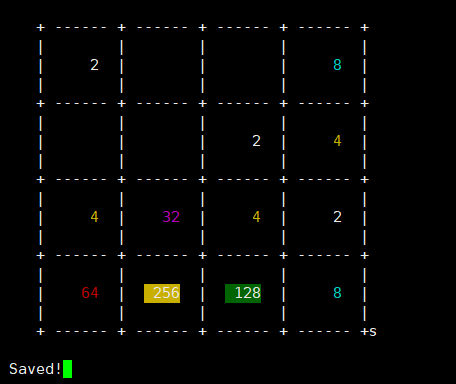
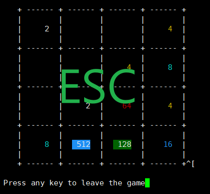
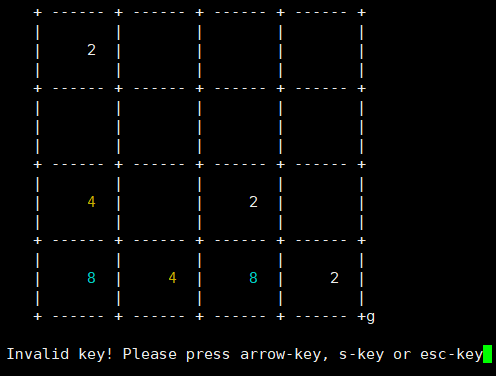
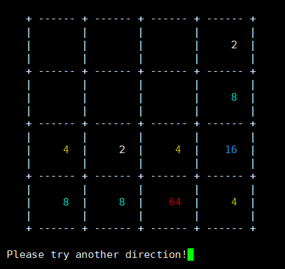

# 2048_CPP
Game 2048 written in C++
Run on linux. NOT WINDOWS !!!

## 一、依赖项
本程序只能在`Linux`平台运行，依赖`ncurses`库
暗转`ncurses`库：
```bash
sudo apt install libncurses5-dev
```

## 二、编译运行
### 1. 编译
```bash
make
```

### 2. 执行
使用：
Usage:./out options [filename]
	-h --help: Display this usage information 
	-o --output filename: Save game sense to file
	-i --input filename: Load game from file
	-p --prob number: Set the probability of generate 2, range in (0, 10]
			)
```bash
# 直接运行，默认产生方块2的概率为0.6，保存游戏的文件名为`data`
./out

# 指定产生2的概率为0.8，保存游戏数据的文件名为`latest`
./out -p 8 -o latest

# 从文件`latest`恢复游戏数据
./out -i latest
```

### 3. 操作
+ 上下左右键：移动方格
+ esc键：退出游戏
+ s键：保存当前游戏至文件（默认文件名为`data`，可指定其他名称）


### 4. 效果图
正常游戏：

保存游戏：(按‘S’键)

退出游戏：(按‘ESC’键)、

无效方向键

无效键



